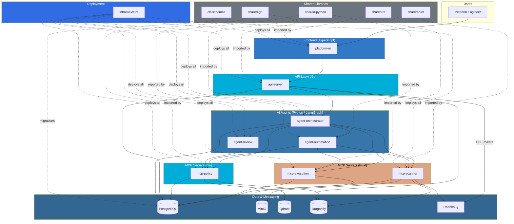

# Doki Stack

**AI-driven infrastructure automation with mandatory human approval.**

Doki Stack is an open-core platform where platform engineers describe infrastructure changes in natural language. The system generates, validates, and applies those changes (Terraform, Ansible) with mandatory human-in-the-loop approval at every step.

## Key Principles

- **HITL is mandatory** — No infrastructure change without explicit human approval
- **Fail closed** — If policy or context is unavailable, block
- **Multi-tenant** — `org_id` scoped isolation everywhere
- **Agents learn** — Memory MCP stores preferences and outcomes per org
- **Extensible** — Register custom MCP servers to integrate any data source

## Architecture

## Repositories

### Community Edition (Apache 2.0)

| Repo | Language | Purpose |
|------|----------|---------|
| [shared-go](https://github.com/Doki-Stack/shared-go) | Go | Shared utilities, logging, OTel |
| [shared-rust](https://github.com/Doki-Stack/shared-rust) | Rust | Shared crate, tracing, OTel |
| [shared-python](https://github.com/Doki-Stack/shared-python) | Python | Shared Pydantic models, OTel |
| [shared-ts](https://github.com/Doki-Stack/shared-ts) | TypeScript | Shared API types for the UI |
| [db-schemas](https://github.com/Doki-Stack/db-schemas) | SQL | Language-agnostic database migrations |
| [mcp-scanner](https://github.com/Doki-Stack/mcp-scanner) | Rust | Repository Scanner MCP |
| [mcp-execution](https://github.com/Doki-Stack/mcp-execution) | Rust | Terraform/Ansible Execution MCP |
| [mcp-policy](https://github.com/Doki-Stack/mcp-policy) | Go | Policy enforcement MCP |
| [mcp-sdk](https://github.com/Doki-Stack/mcp-sdk) | TS + Python | SDK for building custom MCP servers |
| [agent-orchestrator](https://github.com/Doki-Stack/agent-orchestrator) | Python | LangGraph Orchestrator |
| [agent-automation](https://github.com/Doki-Stack/agent-automation) | Python | Automation Agent |
| [agent-review](https://github.com/Doki-Stack/agent-review) | Python | Review Agent |
| [platform-ui](https://github.com/Doki-Stack/platform-ui) | TypeScript | Next.js Platform UI |
| [api-server](https://github.com/Doki-Stack/api-server) | Go | Backend-for-Frontend API |
| [infrastructure](https://github.com/Doki-Stack/infrastructure) | YAML | Kubernetes manifests, GitOps |
| [docs](https://github.com/Doki-Stack/docs) | MkDocs | Documentation |
| [example-mcps](https://github.com/Doki-Stack/example-mcps) | TS + Python | Reference MCP implementations |

## License

Community Edition is licensed under Apache 2.0. Enterprise Edition uses BSL 1.1.
